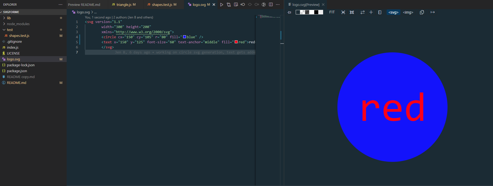

# SVGFORME

## Description

As a new developer, I decided to embark on a project in Node.js to create SVG files representing simple shapes. It turned out to be an incredibly beneficial experience for my learning journey.

By diving into Node.js, I gained a deeper understanding of server-side JavaScript programming. I learned how to manipulate files, manage modules, and render SVG graphics. It was exciting to explore the vast ecosystem surrounding Node.js, discovering libraries like Express or Fastify for server creation, and the powerful SVG.js library for generating SVG elements.

Working on this project allowed me to strengthen my JavaScript skills, grasping important concepts like syntax, data structures, and control flow. It served as an excellent foundation for my future web development endeavors.

Overall, building this Node.js project provided me with invaluable hands-on experience, boosting my confidence and paving the way for more complex web applications.

## Table of Contents

- [Installation](#installation)
- [Usage](#usage)
- [License](#license)
- [Credits](#credits)
- [Tests](#tests)
- [Contact](#contact)

## Installation

1. Ensure Node.js and npm are installed.
2. Install the project dependencies (inquirer, fs, jest).
3. Clone this repository git@github.com:justjenb/svgforme.git.
4. Navigate to the directory containing index.js.
5. Run the script using node index.js from the terminal.
6. Answer the prompts.
7. Check the generated SVG file for accuracy and any other edits.

## Usage

Run the app to generate a quick SVG file for use on your website.

[Link to video demo](https://drive.google.com/file/d/1vjfhk6Yqdu1rK2mWlXZgyJtzfDzPEmsk/view)

## License

**This project is licensed under the [MIT](https://opensource.org/licenses/MIT) license.**

For more information about this license, please visit the following link:

https://opensource.org/licenses/MIT

## Credits

Technical references:

Heavily referenced preceding weeks' materials

https://github.com/SBoudrias/Inquirer.js/blob/master/packages/inquirer/examples/list.js

https://developer.mozilla.org/en-US/docs/Web/SVG/Tutorial/Getting_Started

https://developer.mozilla.org/en-US/docs/Web/SVG/Tutorial/Basic_Shapes

https://www.w3schools.com/graphics/svg_rect.asp

https://www.javatpoint.com/svg-basic-shapes

https://css-tricks.com/how-to-simplify-svg-code-using-basic-shapes/

https://www.motiontricks.com/creating-dynamic-svg-elements-with-javascript/

https://medium.com/beginners-guide-to-mobile-web-development/super-and-extends-in-javascript-es6-understanding-the-tough-parts-6120372d3420

https://developer.mozilla.org/en-US/docs/Web/JavaScript/Guide/Using_promises

https://www.geeksforgeeks.org/how-to-validate-hexadecimal-color-code-using-regular-expression/#

https://jestjs.io/docs/expect

## Tests

Tests provided in tests/shapes.test.js folder.
Tests to instantiate the classes, change color of the SVG, and change text of the SVG.
Testing is done using jest.
Run tests from the console using 'npm test'.

## Contact

My name is Jen Butler.

Here is a link to my [GitHub](https://github.com/justjenb) profile. 

Additional contact details:

You can email me at jen@jenbutler.me
